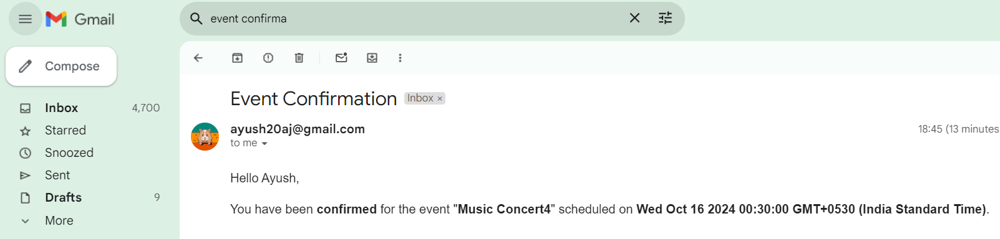

# Authentication using NodeJS and PostgreSQL

This project involves event management system within a Node.js environment, using Postgres as database, in TypeScript.

## Features

1. **Event Creation (Admin-Only)**
   - Admins can create events by specifying:
     - Title
     - Description
     - Date
     - Location
     - Maximum number of participants (`totalSeats`)
   - The `totalSeats` limit applies only to the confirmed list of attendees.

2. **Joining an Event**
   - Users can express interest in joining an event:
     - If the confirmed list has space (i.e., the current count is below `totalSeats`), the user is added to the confirmed list.
     - If the confirmed list is full, the user is added to the waitlist.

3. **Participant Management**
   - Users can view the list of confirmed participants and those on the waitlist for any event.
   - If a user on the confirmed list cancels their participation, the next user on the waitlist is automatically moved to the confirmed list (if space is available).

## Tools Used

##### `VSCode` : Code Editor
##### `Postman` : Application to develop and test API
##### `Neon` : PostgreSQL cloud database
##### `Beekeeper Studio` : Modern SQL database manager
## Run Locally

To run this project locally, Node and Postgres must be installed in the system.

Clone the project

```bash
  git clone https://github.com/ayushjaiz/event-management-api
```

Go to the project directory

```bash
  cd event-management-api
```

Install dependencies

```bash
  npm install
```

Migrate database

```bash
  npm run db:push
```

Start the server

```bash
  npm run start
```


## Environment Variables

Add the following environment variables in .env file as prescribed in .env.example file at project root level


```bash
# app configurations
PORT = 

# database configurations
DATABASE_URL =  

# jwt secret
JWT_SECRET_KEY = 

# email configuration
EMAIL_ADMIN = 
EMAIL_PASSWORD = 
```

## Routes

### Public Routes

| Route                           | Method | Description                               |
|--------------------------------|--------|-------------------------------------------|
| /users/login                    | POST   | Authenticates user and returns JWT token.|
| /users/signup                   | POST   | Registers a new user.                    |

### Protected User Routes

| Route                          | Method | Description                              |
|--------------------------------|--------|------------------------------------------|
| /events/                       | GET    | Retrieves all event information.         |
| /events/:id                    | GET    | Retrieves event information.             |

### Protected Admin Routes

| Route                          | Method | Description                              |
|--------------------------------|--------|------------------------------------------|
| /events/create                 | GET    | Retrieves user profile information.      |
| /participation/register        | GET    | Retrieves user for a event               |
| /participation/cancel/:id      | GET    | Cancels registration for the event       |

## Screenshots


#### Confirmation Email




## Future Improvements

- Queue the email process
- Better error handing
- Dockerize the application
